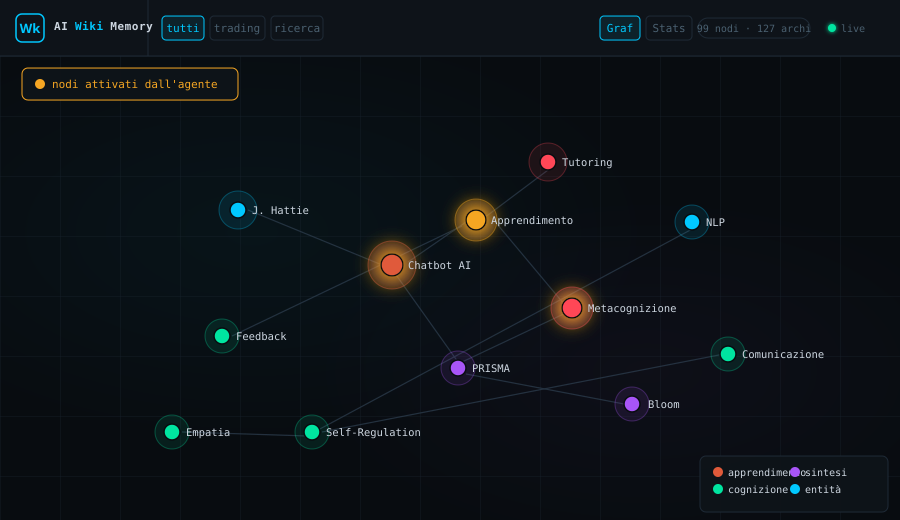
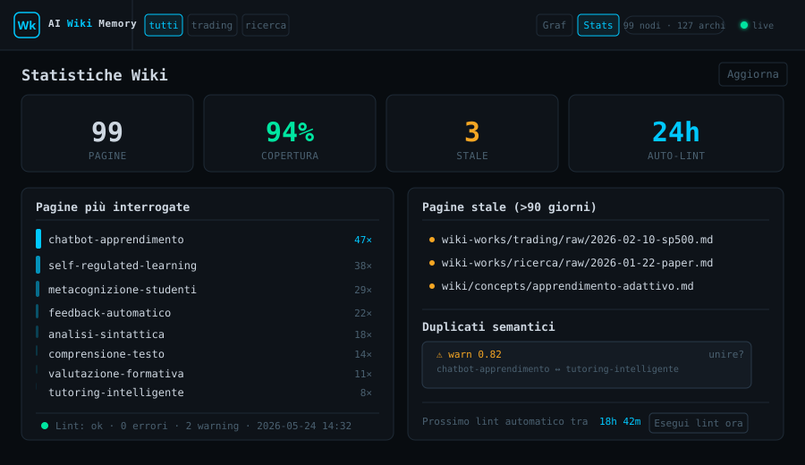

<div align="center">

# AI Longterm Wiki Memory — Claude Code

**Semantic long-term memory for Claude Code**

Claude Code forgets everything between sessions. This gives it a structured, self-healing knowledge base it actually maintains — where every page is simultaneously a readable document and a searchable vector.

[](#changelog)
[](mcp-server/tests/)
[](https://nodejs.org/)
[](https://www.python.org/)
[](LICENSE)
[](https://claude.ai/code)

[Quick Start](#quick-start) · [Features](#features) · [Architecture](#architecture) · [PDF Ingestion](#multi-source-pdf-ingestion) · [Web Interface](#web-interface) · [Dashboard](#dashboard-observability) · [MCP Tools](#mcp-tools) · [CLI Reference](#cli-reference)

---

</div>

> ### 🤖 If you are an AI agent reading this repo
>
> **Before any action, read [`CLAUDE.md`](CLAUDE.md)** — it contains mandatory setup instructions.
> Skipping it means context injection will not work and every subsequent action may silently fail.

## Interface

**Graph view** — the D3 force graph shows all wiki pages as nodes, coloured by category. When the agent retrieves pages to answer a prompt, the activated nodes pulse gold in real time via WebSocket.



**Stats tab** — embedding coverage, most-queried pages, stale pages, semantic duplicate warnings, and auto-lint countdown.



---

## The problem

AI agents forget everything between sessions. Existing memory systems are flat — a pile of timestamped facts, not a knowledge base. When you work on recurring research (academic literature, competitive analysis, trading signals, legal cases), you need knowledge that is **organized, interconnected, and semantically searchable** — and that grows over time without human bookkeeping.

## What it does

AI Longterm Wiki Memory gives Claude Code a **three-layer brain** it maintains autonomously — all layers indexed together in a single LanceDB vector space:

| Layer | Directory | Contents | Who writes |
|-------|-----------|----------|------------|
| **Domain knowledge** | `wiki-works/<topic>/` | Deep knowledge per domain: concepts, research, entities | INGEST workflow |
| **Distilled knowledge** | `wiki/` | Cross-domain knowledge, promoted autonomously when useful across ≥2 topics | Agent (autonomous promotion) |
| **Identity** | `wiki/identity/` | Behavioral patterns, values, style — learned from corrections | Only `wiki.py self-reflect` |

The agent ingests web pages, papers, and PDFs; retrieves by semantic meaning (not keywords); promotes knowledge autonomously between layers; detects stale or contradictory knowledge; and synthesizes new pages automatically when multiple sources support a non-obvious inference — all without corrupting the knowledge base even if a process crashes mid-operation.

```
User: "study this paper on RAG architectures"

Agent: [INTENT: INGEST | WORKSPACE: research | CONFIDENCE: high]
       → writes structured pages as .tmp files
       → wiki.py ingest: atomic staging → production commit
       → markdown + embeddings written in the same operation
       → "2 pages written. Mini-lint: ok."
       → checks promotion criteria: retrieved in ≥3 queries, cross-domain?
       → promotes to wiki/concepts/rag.md autonomously if criteria met

User: "what do you know about retrieval-augmented generation?"

Agent: [INTENT: QUERY | WORKSPACE: research | CONFIDENCE: high]
       → <wiki-context> already injected (pre-prompt hook)
       → reads relevant pages, synthesizes with citations
       → synthesis meets threshold → auto-saved as new wiki page

User: "stop adding a summary at the end of every response"

Agent: [INTENT: BEHAVIOR_FEEDBACK | CONFIDENCE: high]
       → wiki.py behavior-log --event "no trailing summary"
       → at session end: wiki.py self-reflect → wiki/identity/ updated
```

---

## The core idea: wiki and vector DB as one

> **Karpathy's wiki pattern** ([gist](https://gist.github.com/karpathy/442a6bf555914893e9891c11519de94f)) has the LLM navigate the wiki by *reading* markdown files. This breaks down at scale — the agent cannot scan dozens of pages on every query.

This project solves that with a **dual-representation architecture**: every page has two synchronized forms.

```
  Write a wiki page
        │
        ▼
┌───────────────────┐     ┌──────────────────────────┐
│  Markdown file    │     │  LanceDB vector store     │
│  wiki/concepts/   │◄────►  bge-m3 embeddings        │
│  rag.md           │     │  (1024-dim, HNSW index)   │
└───────────────────┘     └──────────────────────────┘
   humans browse               LLM retrieves
   LLM generates               semantically
```

Markdown and embeddings are **written atomically** and kept in sync at all times. The lint pass detects and repairs any drift.

A query about *"how LLMs handle long context"* retrieves pages about *"positional encoding"* and *"sliding window attention"* — with no keyword overlap — because the meaning is close in embedding space.

---

## Features

### Semantic vector search
[bge-m3](https://huggingface.co/BAAI/bge-m3) embeddings — multilingual (100+ languages), 1024-dim, HNSW index. Queries retrieve by meaning. No re-indexing step. The vector DB is the index, maintained continuously.

### Atomic writes — crash-safe
Every ingest follows a `.tmp → staging LanceDB → atomic promotion` pattern. A crash leaves the system in a detectable state (`in-progress` in `wiki-session.md`). The agent recovers at the next session with no data loss, no silent corruption.

### Pre-prompt context injection
`wiki_context.py` runs a vector search **before every user message** and prepends a `<wiki-context>` block with the most relevant pages. This eliminates the main failure mode of skill-based approaches — the agent getting context only when it classifies a message as QUERY:

```
User types a message
        │
        ▼
UserPromptSubmit hook → wiki_context.py → vector search
        │
        ▼
<wiki-context> block prepended to the prompt
        │
        ▼
Agent has relevant context — regardless of intent classification
```

Install with one command:
```bash
node installer/dist/install.js --workspace /path/to/workspace
```

### Native MCP tools
Four tools registered directly in Claude Code: `wiki_query`, `wiki_ingest`, `wiki_lint`, `wiki_serve`. Claude can call them explicitly from the conversation, not just via the automatic hook.

### Multi-project routing
Define multiple research domains in `wiki.config.json` with keyword lists. The agent auto-selects the right workspace from message content — no manual specification needed.

### Automatic synthesis
When a query response integrates ≥2 wiki sources, exceeds 300 tokens, and adds non-literal inference, the agent saves it as a new wiki page with embeddings. Knowledge compounds over time.

### Self-healing lint
`wiki.py lint --full` detects and repairs:
- **Broken wiki links** (`[[page]]` with no matching file)
- **Orphan LanceDB entries** (vectors for deleted files — auto-removed)
- **Renames** (file moved → updates DB path without re-embedding via `content_hash`)
- **Semantic duplicates** (cosine similarity > 0.95 across pages)

### Token-budget index
`index.md` respects a configurable token budget (default 4000). When exceeded, applies reduction strategies automatically — so the agent can navigate even on small context windows.

### Observability dashboard
A `[Stats]` tab in the web frontend gives a live view of the wiki health: pages embedded vs unembedded, stale pages (configurable threshold), top-10 most queried pages, lint status with last-run timestamp and warning count, and the auto-lint schedule. Lint can also be triggered manually from the browser.

### Autonomous promotion
When a page from `wiki-works/<topic>/` is retrieved in ≥3 distinct queries and proves relevant across ≥2 topics, the agent promotes it to `wiki/` without user confirmation — cross-domain knowledge compounds automatically.

### Semantic deduplication
`wiki.py lint --full` detects semantically similar pages via cosine similarity. Similarity ≥ 0.90 → auto-merge candidate; 0.75–0.90 → user warning. Configurable via `thresholds.dedup_auto` and `thresholds.dedup_warn`.

### Behavioral self-reflection (Identity layer)
When the user corrects the agent's behavior ("always", "never", "stop doing X"), the correction is logged with `wiki.py behavior-log`. At end of session, `wiki.py self-reflect` reads the log and autonomously updates `wiki/identity/` when a pattern reaches the threshold (default: 3 occurrences). The agent learns without human approval of each update.

---

## Multi-source PDF ingestion

Any PDF from any source converges at `pdf-inbox/` and is processed automatically.

```
┌──────────────────┐   ┌───────────────────┐
│  CLI / URL       │   │  Manual file drop │
│  (ingest-pdf)    │   │  (filesystem)     │
└────────┬─────────┘   └────────┬──────────┘
         └─────────────┬─────────┘
                       ▼
            workspace/pdf-inbox/
               paper.pdf
            .registry.json  ← SHA-256 hash per file
                       │
            wiki.py scan-inbox
                       │
            wiki_pdf_watcher.py
               extract_text (pdfplumber)
                       │
                       ▼
      wiki-works/<project>/raw/paper.md
                       │
                       ▼
            Agent structures into .tmp pages
                       │
                       ▼
            wiki.py ingest → wiki/ + LanceDB
```

**Commands:**
```bash
# Local file
wiki.py ingest-pdf --workspace <path> --file paper.pdf

# Remote URL (50 MB cap — SSRF-protected)
wiki.py ingest-pdf --workspace <path> --file https://arxiv.org/pdf/2401.00001

# Scan entire inbox — idempotent, safe for cron
wiki.py scan-inbox --workspace <path>
```

**Scanned PDFs** (no selectable text) are flagged with `status: failed` in the registry and skipped on future scans — no infinite retry loops.

---

## Web Interface

A read-only web frontend for exploring the wiki in a browser — without touching any workflow.

```bash
wiki.py serve --workspace /path/to/workspace [--port 7331] [--no-auth]
```

Open `http://localhost:7331`.

```
┌──────────────────────────────────────────────────────────┐
│  AI Wiki Memory   [wiki] [research] [all]      🔍  ● live │
├───────────────────────────┬──────────────────────────────┤
│                           │  # Page Title                │
│    KNOWLEDGE GRAPH        │  concept · research · date   │
│    (D3 force-directed)    │  ──────────────────────────  │
│                           │  [rendered markdown]         │
│  ● entities (blue)        │                              │
│  ● concepts (green)       │  ── Outgoing links ──        │
│  ● synthesis (violet)     │  ── Incoming links ──        │
│  ── explicit link         │  ── Similar pages ──         │
│  ╌╌ semantic similarity   │     embedding (87%)          │
└───────────────────────────┴──────────────────────────────┘
```

**Features:**
- **Force-directed graph** — nodes sized by degree, colored by category (entities/concepts/synthesis), labels on all nodes
- **Explicit edges** — `[[wiki-link]]` references rendered as solid arrows
- **Semantic edges** — LanceDB cosine similarity ≥ 0.65 rendered as dashed lines
- **Live updates** — WebSocket pushes `graph_update` on any file change; graph transitions smoothly without snapping node positions
- **Query hit animation** — when the hook retrieves pages, those nodes pulse gold→red for 4 seconds in real time
- **Page panel** — click any node → rendered markdown, outgoing/incoming links, similar pages with similarity bars
- **Project tabs** — filter graph to one workspace at a time
- **Password protection** — JWT cookie auth (7-day session); set via `wiki.config.json` or `WIKI_PASSWORD` env var; bypass with `--no-auth` for local use

**Config (optional):**
```json
{
  "frontend": {
    "password": "your-password",
    "session_days": 7
  }
}
```

**The frontend is strictly read-only for wiki content.** All wiki workflows (ingest, query, lint) continue to function identically whether the server is running or not.

---

## Dashboard Observability

A `[Stats]` tab built into the web server shows the health of the wiki at a glance — no CLI commands needed.

```
┌──────────────────────────────────────────────────────────┐
│  AI Wiki Memory  [Graph] [Stats]          🔍  ● live     │
├──────────────────────────────────────────────────────────┤
│  ┌──────────┐  ┌──────────┐  ┌──────────┐  ┌─────────┐  │
│  │ 47 pages │  │ 312 chunk│  │ 94% cov. │  │ 3 stale │  │
│  └──────────┘  └──────────┘  └──────────┘  └─────────┘  │
│                                                          │
│  Top queried                  Lint status                │
│  ─────────────────            ─────────────────────────  │
│  rag.md           12q         Last run: 2026-05-23       │
│  openai.md         8q         0 errors · 2 warnings      │
│                               [Run lint now]             │
│  Auto-lint: every 24h · next: 2026-05-24 08:15           │
└──────────────────────────────────────────────────────────┘
```

**What it shows:**
- **4 KPI cards** — total pages, total chunks, embedding coverage %, stale pages count
- **Top queried** — top-10 pages by query frequency, aggregated from `.wiki-query-log.jsonl`
- **Stale pages** — pages not modified in more than `thresholds.staleness_days` (default 90 days)
- **Unembedded pages** — files present on disk but missing from LanceDB
- **Lint status** — last run timestamp, error count, warning count
- **Auto-lint schedule** — next scheduled run if `frontend.lint_interval_hours` is configured

**Auto-lint:** Add to `wiki.config.json`:
```json
{
  "frontend": {
    "lint_interval_hours": 24
  }
}
```

---

## Quick Start

### Requirements

- Python 3.10+ — ~2 GB disk for BAAI/bge-m3 (downloaded automatically on first run)
- Node.js 20+
- Claude Code CLI

### Install

```bash
git clone https://github.com/giovannifrontera/ai-longterm-wiki-memory-ClaudeCode
cd ai-longterm-wiki-memory-ClaudeCode
pip install -r requirements.txt
cd mcp-server && npm install && npm run build && cd ..
cd installer && npm install && npm run build && cd ..
```

### Configure

```bash
mkdir /path/to/your/workspace
cp wiki.config.json.example /path/to/your/workspace/wiki.config.json
```

Edit `wiki.config.json` — set `workspace` to the absolute path, define your projects:

```json
{
  "workspace": "/absolute/path/to/workspace",
  "pdf_inbox": {
    "project_default": "research"
  },
  "projects": {
    "research": {
      "path": "wiki-works/research",
      "keywords": ["paper", "study", "article", "review"]
    }
  },
  "thresholds": {
    "index_token_budget": 4000,
    "staleness_days": 90,
    "similarity_merge": 0.95,
    "similarity_orphan": 0.50,
    "synthesis_min_tokens": 300,
    "synthesis_min_sources": 2,
    "chunk_size_tokens": 512,
    "chunk_overlap_tokens": 64,
    "page_chunk_threshold_tokens": 1500,
    "quality_filter_min_score": 6
  },
  "lancedb": {
    "path": "memory/lancedb",
    "embedding_model": "BAAI/bge-m3"
  }
}
```

### Initialize and integrate

```bash
# Initialize the vector index
python scripts/wiki.py rebuild --workspace /path/to/workspace

# Install hook + MCP server into Claude Code
node installer/dist/install.js --workspace /path/to/workspace
```

Restart Claude Code. Done.

### Dependencies

| Package | Purpose |
|---------|---------|
| `lancedb ≥ 0.6.0` | Vector database — stores bge-m3 embeddings with staging table for atomic ingest |
| `sentence-transformers ≥ 3.0.0` | Loads BAAI/bge-m3 locally — multilingual chunked embedding |
| `pyarrow ≥ 14.0.0` | Columnar storage for LanceDB batch operations |
| `pandas ≥ 2.0.0` | DataFrame ops for lint statistics and rename detection |
| `pdfplumber ≥ 0.11.0` | PDF text extraction — used by `wiki_pdf_watcher.py` |
| `pyyaml ≥ 6.0` | Parses `wiki.config.json` and YAML frontmatter |
| `requests ≥ 2.31.0` | HTTP fetching during source ingestion |
| `fastapi ≥ 0.111.0` | Web server for the browser frontend |
| `uvicorn[standard] ≥ 0.29.0` | ASGI server — runs FastAPI with WebSocket support |
| `watchfiles ≥ 0.21.0` | Async file watcher — triggers live graph updates |
| `python-jose[cryptography] ≥ 3.3.0` | JWT cookie auth for the frontend |

---

## Architecture

```
workspace/
├── wiki-session.md           ← live session state (generated by wiki.py)
├── wiki.config.json          ← configuration
├── wiki/                     ← distilled cross-domain knowledge + identity layer
│   ├── entities/             ← people, tools, organizations (cross-domain)
│   ├── concepts/             ← theories, strategies, definitions (cross-domain)
│   ├── synthesis/            ← cross-source inferences (cross-domain)
│   └── identity/             ← behavioral patterns (written only by self-reflect)
├── wiki-works/               ← deep domain knowledge (permanent, per topic)
│   └── <topic>/
│       ├── raw/              ← raw fetched sources and extracted PDFs
│       ├── entities/
│       ├── concepts/
│       └── synthesis/
└── memory/
    └── lancedb/              ← vector database — all three layers indexed together
```

**Repo structure:**
```
ai-longterm-wiki-memory-ClaudeCode/
├── mcp-server/          ← TypeScript MCP server (4 tools)
│   ├── src/
│   │   ├── index.ts     ← entry point, wires tools, reads --workspace from argv
│   │   ├── bridge.ts    ← execFile wrapper: runs Python scripts async
│   │   └── tools/       ← wiki_query, wiki_ingest, wiki_lint, wiki_serve
│   └── dist/            ← compiled output
├── installer/           ← CLI installer
│   └── install.ts       ← auto-detects Python+lancedb, writes hook + mcpServers
├── scripts/             ← Python core (wiki.py, wiki_context.py, ...)
└── frontend/            ← web dashboard SPA (D3.js graph + stats)
```

**Two independent channels:**

| Channel | Trigger | What it does |
|---------|---------|--------------|
| Hook (`UserPromptSubmit`) | Every prompt, automatically | Runs `wiki_context.py`, prepends `<wiki-context>` |
| MCP tools | When Claude calls them | Runs `wiki.py` commands (ingest, lint, serve, query) |

If the hook fails, MCP tools still work. If MCP is unavailable, the hook still injects context.

**Core invariant:** The agent never writes directly to the wiki. Everything goes through `wiki.py`. The skill guides *when* and *why*; the scripts handle *how*.

---

## MCP Tools

| Tool | Script | Description |
|------|--------|-------------|
| `wiki_query` | `wiki_context.py` | Search wiki pages by semantic query — use when `<wiki-context>` wasn't enough |
| `wiki_ingest` | `wiki.py ingest` | Add structured knowledge pages to the wiki |
| `wiki_lint` | `wiki.py lint` | Find and fix stale vectors, broken links, semantic duplicates |
| `wiki_serve` | `wiki.py serve` | Launch the dashboard at `http://localhost:7331` |

When `<wiki-context>` is already in the prompt context, use it directly — do not call `wiki_query` again for the same query.

---

## Installer CLI Reference

```bash
node installer/dist/install.js [options]

  --workspace <path>    Required. Absolute path to the wiki workspace.
  --k <n>              Chunks to inject per prompt (default: 3).
  --python <exe>       Python executable (auto-detected if omitted).
  --global             Install into ~/.claude/settings.json instead of local.
  --dry-run            Preview settings.json output without writing.
  --uninstall          Remove hook and mcpServers entry.
```

**Python auto-detection:** tries `py`, `python`, `python3` (Windows) or `python3`, `python` (Linux/macOS) — picks the first that can `import lancedb`.

**Manual MCP registration (alternative to installer):**
```bash
claude mcp add wiki-context -- node /absolute/path/to/mcp-server/dist/index.js --workspace /absolute/path/to/wiki
```

---

## CLI Reference

```
wiki.py <command> [arguments]

  ingest         --workspace <path> --pages <p1.tmp,p2.tmp,...>
  query          --workspace <path> --q <string> [--k 5]
  lint           --workspace <path> [--full]
  rebuild        --workspace <path>
  scan-inbox     --workspace <path>
  ingest-pdf     --workspace <path> --file <local-path|url>
  serve          --workspace <path> [--host 127.0.0.1] [--port 7331] [--no-auth]
  behavior-log   --workspace <path> --event "<canonical correction phrase>"
  self-reflect   --workspace <path>
```

Every command outputs JSON to stdout.

---

## How It Works

**Chunking** — Pages split using the bge-m3 native tokenizer. Boundaries respect `##` and `###` headings — chunks never cut mid-section. Pages under 1500 tokens are embedded whole; larger pages are chunked at 512 tokens with 64-token overlap.

**Staging table** — Ingest writes vectors to `staging_wiki_pages` first. Only `promote_staging()` moves them to `wiki_pages`. A crash leaves staging populated; the next session clears it and logs the event.

**Rename detection** — During lint, compares `content_hash` between DB-only paths and filesystem-only paths. Matching hashes = rename → path updated in DB without re-embedding.

**PDF crash recovery** — Status `pending` is written to `.registry.json` before extraction begins. A mid-operation crash leaves `pending`, which triggers reprocessing on the next scan.

---

## Comparison with Karpathy's pattern

| Dimension | Karpathy's pattern | AI Longterm Wiki Memory |
|-----------|-------------------|------------------------|
| **Form** | Conceptual pattern — prose + guidelines | Full Python implementation with CLI |
| **Retrieval** | LLM reads/scans markdown files | Semantic vector search — LLM never scans files |
| **Wiki + vectors** | Separate concerns | One atomic operation: write page = write embeddings |
| **Crash safety** | Not addressed | Atomic `.tmp → staging → promotion` pipeline |
| **Multi-project** | Single wiki | Routed workspaces via `wiki.config.json` |
| **PDF ingestion** | Not addressed | Multi-source: URL, CLI, folder drop |
| **Knowledge compounding** | Query answers stay in chat | Auto-synthesis + autonomous promotion across three layers |
| **Lint** | Basic health check concept | Self-healing: orphan vectors, semantic duplicates, renames |
| **Context injection** | Not addressed | `wiki_context.py` pre-injects relevant pages before every prompt |
| **Behavioral learning** | Not addressed | `behavior-log` + `self-reflect` → `wiki/identity/` updated autonomously |
| **Visualization** | Not addressed | Interactive D3 graph with live WebSocket updates |
| **Languages** | English-focused | Multilingual — bge-m3 supports 100+ languages |

---

## Looking for the OpenClaw integration?

This repo is for Claude Code CLI. If you use [OpenClaw](https://github.com/openclaw/openclaw) (Telegram, Discord, web), see [`ai-longterm-wiki-memory-OpenClaw`](https://github.com/giovannifrontera/ai-longterm-wiki-memory-OpenClaw) — same system, different adapter.

---

## License

AGPL-3.0 — requires anyone who distributes or runs the software as a service to share the source code.

---

<div align="center">

Embeddings by [BAAI/bge-m3](https://huggingface.co/BAAI/bge-m3) · Vector store by [LanceDB](https://lancedb.github.io/lancedb/) · Also available for [OpenClaw](https://github.com/giovannifrontera/ai-longterm-wiki-memory-OpenClaw)

</div>
